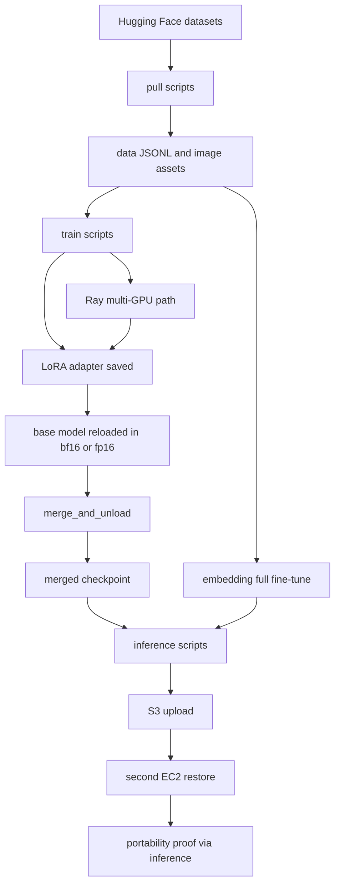

# EC2 Fine-Tuning V1

> A class-ready AWS EC2 lab for LLM, DPO, VLM, embedding, and Ray multi-GPU fine-tuning.

This repository is built to teach the full applied workflow, not to chase leaderboard numbers. The emphasis is on a pipeline that is easy to inspect, easy to rerun, and easy to explain in a classroom or portfolio setting.

## Quick Navigation

- [Run it now](RUNBOOK.md)
- [Watchouts](docs/WATCHOUTS.md)
- [Quantization and merge notes](docs/QUANTIZATION_AND_MERGE.md)
- [Library and framework stack](docs/LIBRARY_FRAMEWORK_STACK.md)

---

## Project Snapshot

| Area | What you get |
|---|---|
| LLM SFT | QLoRA training, adapter save, inline merge, merged-checkpoint inference |
| DPO | Preference tuning with the same adapter-to-merged lifecycle |
| VLM | BLIP LoRA fine-tuning with image-caption workflow |
| Embedding | Full SentenceTransformer fine-tuning plus retrieval demo |
| Ray multi-GPU | One-worker-per-GPU distributed LLM training on EC2 |
| Portability | Upload outputs to S3 and restore them on another EC2 machine |

---

## What This Repo Teaches

### `LLM SFT`
Train a small instruction model with QLoRA, save the adapter, merge it into a standalone checkpoint, and infer from the merged artifact.

### `DPO`
Run preference alignment with TRL while keeping the same practical adapter and merge flow used in the SFT path.

### `VLM`
Fine-tune a compact vision-language model with LoRA so the multimodal path stays lightweight enough for teaching and demos.

### `Embedding`
Train an embedding model as a full-model fine-tune and use it in a simple retrieval workflow.

### `Ray Multi-GPU`
Scale the LLM path to multiple GPUs on one EC2 box without introducing a separate cluster-management story.

---

## Models and Data

| Track | Base model | Dataset source |
|---|---|---|
| LLM SFT | `Qwen/Qwen2.5-0.5B-Instruct` | `yahma/alpaca-cleaned` |
| DPO | `Qwen/Qwen2.5-0.5B-Instruct` | `trl-lib/ultrafeedback_binarized` |
| VLM | `Salesforce/blip-image-captioning-base` | `nlphuji/flickr30k` |
| Embedding | `sentence-transformers/all-MiniLM-L6-v2` | local JSONL derived from pulled HF data |
| Ray multi-GPU | `Qwen/Qwen2.5-0.5B-Instruct` | reuses the LLM SFT dataset path |

These models are intentionally small enough for realistic classroom EC2 budgets.

---

## End-to-End Flow

### Practical Lifecycle

1. Pull data from Hugging Face into local JSONL or image folders.
2. Train the task-specific model path.
3. Save the adapter for LoRA-based tracks.
4. Merge into a standalone checkpoint inside the training flow.
5. Run inference locally.
6. Upload outputs to S3.
7. Restore on another EC2 instance and prove the artifact is portable.

---

## Why Inline Merge Matters

QLoRA training uses a 4-bit base model to make training affordable on smaller GPUs. That quantized training load is not the final deployment artifact. After training, the script reloads the original base model in bf16 or fp16, applies the adapter, and runs `merge_and_unload()` to produce a clean standalone checkpoint.

That is why the main inference flow prefers the merged checkpoint first: it is simpler to move, simpler to load, and does not require PEFT reconstruction logic at inference time.

---

## One Important Exception: Embeddings

The embedding track does not use LoRA. It is a standard full-model fine-tune through `SentenceTransformer.fit()`, so there is no adapter artifact and no merge step. The saved output is already the complete model.

---

## Repo Structure

| Path | Purpose |
|---|---|
| `configs/` | YAML configuration files for each training path |
| `pull/` | Data acquisition scripts that convert source data into local training files |
| `train/` | Training entrypoints for LLM, DPO, embedding, and VLM tracks |
| `merge/` | Optional standalone merge utility for manual re-merge flows |
| `infer/` | Inference entrypoints for merged, adapter, embedding, and VLM checks |
| `ray/` | Multi-GPU Ray training implementation |
| `scripts/` | Shell wrappers for setup, training, inference, upload, and restore |
| `utils/` | Shared helpers for config loading, JSONL handling, and experiment tracking |
| `docs/` | Supporting explainers and operational watchouts |

Generated runtime folders such as `data/`, `outputs/`, `logs/`, and `mlruns/` are intentionally part of the workflow but should not be treated as source code.

---

## Tracking and Observability

| Tool | Usage |
|---|---|
| W&B | Enabled by config for training run tracking; disable with `report_to: []` |
| MLflow | Local tracking store at `./mlruns`, typically exposed over an SSH tunnel |
| Training summaries | Per-track output artifacts such as `training_summary.json` |

---

## Read This Before Running

- Start with the smoke-test scale such as `max_samples: 20`.
- Keep model artifacts and run outputs out of Git; use S3 for transport.
- Never expose MLflow or Ray ports publicly on EC2.
- Treat the merged checkpoint as the default portable artifact.

For exact EC2 launch steps, environment setup, login flow, training commands, and multi-GPU runtime operations, go to [RUNBOOK.md](RUNBOOK.md).

